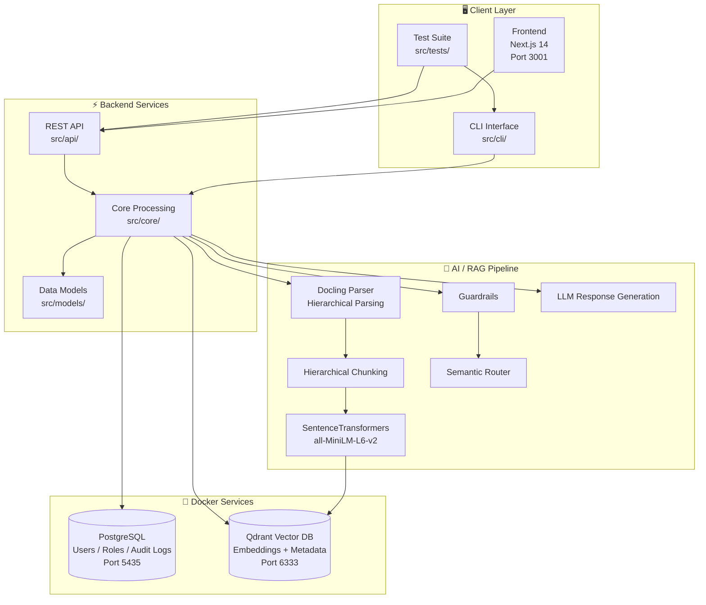
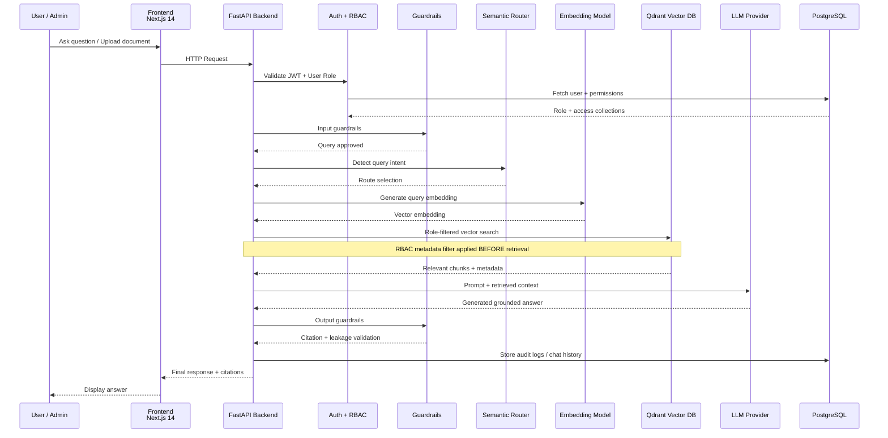

# FinBot Architecture

**Visual diagrams of the FinBot system components, data flow, and RAG pipeline**

---

## 🏗️ System Components



---

## 🔄 Request Data Flow



---

## 🧠 RAG Pipeline

```
📝 Query Input
     ↓
🛡️  Input Guardrails (Component 3)
     ├── Off-topic Detection
     ├── Prompt Injection Prevention
     ├── PII Detection & Scrubbing
     └── Rate Limiting (20/session)
     ↓
🧠 Semantic Router (Component 2)
     ├── Intent Classification (5 routes)
     ├── RBAC-Enforced Routing
     └── Collection Targeting
     ↓
🔍 Vector Search & RAG Processing
     ├── Role-Based Document Filtering
     ├── Hierarchical Chunk Retrieval
     └── Groq LLM Response Generation
     ↓
🛡️  Output Guardrails (Component 3)
     ├── Citation Enforcement
     ├── Cross-Role Leakage Prevention
     └── Response Grounding Validation
     ↓
📤 Final Response + Guardrail Metadata
```

---

## 🔐 RBAC Access Matrix

```
Collection     │ employee │ finance │ engineering │ marketing │ hr │ c_level
───────────────┼──────────┼─────────┼─────────────┼───────────┼────┼────────
general        │    ✅    │   ✅    │     ✅      │    ✅     │ ✅ │   ✅
finance        │    ❌    │   ✅    │     ❌      │    ❌     │ ❌ │   ✅
engineering    │    ❌    │   ❌    │     ✅      │    ❌     │ ❌ │   ✅
marketing      │    ❌    │   ❌    │     ❌      │    ✅     │ ❌ │   ✅
hr             │    ❌    │   ❌    │     ❌      │    ❌     │ ✅ │   ✅
```

---

## 🐳 Docker Services

```
docker compose up -d
│
├── finbot-postgres (postgres:16-alpine)
│   ├── Port: 5435
│   ├── DB: finbot_db
│   ├── User: finbot / finbot123
│   └── Volume: postgres_data
│
└── finbot-qdrant (qdrant/qdrant:latest)
    ├── Port: 6333 (REST)
    ├── Port: 6334 (gRPC)
    └── Volume: qdrant_data
```
