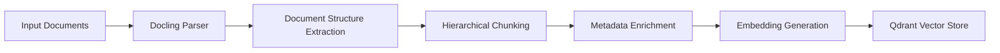
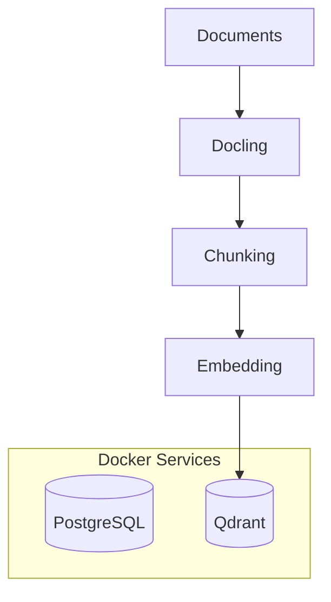

# ✅ Component 1: Document Ingestion with Hierarchical Chunking

## 📌 Overview

This component implements the document ingestion pipeline for **FinBot**, enabling structured parsing, hierarchical chunking, metadata enrichment, embedding generation, and secure storage into the vector database.

Traditional fixed-size chunking often breaks semantic structure by splitting tables, headings, code blocks, and related content into disconnected chunks. To overcome this limitation, FinBot uses **Docling-based hierarchical parsing** to preserve document structure and improve retrieval quality.

The ingestion pipeline supports:

- PDF documents
- Markdown documents
- DOC/DOCX documents
- Structured metadata extraction
- Role-based access control metadata
- Hierarchical chunk relationships
- Embedding generation
- Vector storage in Qdrant

---

# 🏗️ Architecture Flow



---

# 📂 Supported Collections

| Collection | Example Documents | Accessible Roles |
|---|---|---|
| `general` | HR handbook, policies, FAQs | All |
| `finance` | Annual reports, budgets | finance, c_level |
| `engineering` | Architecture docs, APIs, runbooks | engineering, c_level |
| `marketing` | Campaign reports, competitor analysis | marketing, c_level |

---

# 🧠 Why Hierarchical Chunking?

Fixed-size chunking causes several problems:

| Problem | Example |
|---|---|
| Broken tables | Financial values split across chunks |
| Lost section context | Heading separated from paragraph |
| Poor retrieval precision | Irrelevant partial matches |
| Weak grounding | Missing surrounding context |

Hierarchical chunking preserves:

- Section hierarchy
- Parent-child relationships
- Table integrity
- Code block integrity
- Semantic continuity

---

# ⚙️ Ingestion Pipeline

## Step 1 — Document Parsing with Docling

FinBot uses **Docling** to parse documents while preserving structure.

### Extracted Structure

```text
Document
 ├── Section
 │    ├── Subsection
 │    │     ├── Paragraph
 │    │     ├── Table
 │    │     └── Code Block
```

Supported extracted content types:

- Headings
- Paragraphs
- Tables
- Lists
- Code blocks
- Page metadata

---

## Step 2 — Hierarchical Chunking

Each leaf node becomes a searchable chunk.

### Chunk Types

| Chunk Type | Description |
|---|---|
| `text` | Paragraph content |
| `table` | Structured table content |
| `heading` | Section headings |
| `code` | Code snippets / API examples |

Each chunk also stores:
- Parent section reference
- Section summary
- Page information

---

## Step 3 — Metadata Enrichment

Every chunk is enriched with RBAC-aware metadata.

### Metadata Schema

| Field | Description |
|---|---|
| `source_document` | Original filename |
| `collection` | Document collection |
| `access_roles` | Allowed user roles |
| `section_title` | Parent section heading |
| `page_number` | Source page |
| `chunk_type` | text/table/code/heading |
| `parent_chunk_id` | Parent hierarchy reference |

Example:

```json
{
  "source_document": "annual_report_2024.pdf",
  "collection": "finance",
  "access_roles": ["finance", "c_level"],
  "section_title": "Revenue Growth",
  "page_number": 18,
  "chunk_type": "table",
  "parent_chunk_id": "sec_18_revenue"
}
```

---

# 🔐 RBAC Enforcement

Role-based access control is enforced directly at the vector retrieval layer.

This ensures:
- Unauthorized chunks are never retrieved
- Restricted content never reaches the LLM
- Prompt injection attempts cannot bypass access rules

Example Qdrant filter:

```python
models.Filter(
    must=[
        models.FieldCondition(
            key="access_roles",
            match=models.MatchAny(any=["engineering"])
        )
    ]
)
```

---

# 🧬 Embedding Generation

Embeddings are generated using:

```text
SentenceTransformers
all-MiniLM-L6-v2
```

### Why this model?

- Lightweight
- Fast inference
- Good semantic retrieval quality
- Suitable for local development

---

# 🗄️ Vector Database

FinBot uses **Qdrant** as the vector database.

Stored information:
- Embeddings
- Metadata
- Chunk hierarchy
- Access control metadata

---

# 🐳 Docker Services



---

# 📁 Project Structure

```text
src/
├── ingestion/
│   ├── parser.py
│   ├── chunking.py
│   ├── embeddings.py
│   └── qdrant_store.py
│
├── models/
│   └── metadata_models.py
│
└── core/
    └── ingestion_service.py
```

---

# 🚀 Running the Ingestion Pipeline

## 1️⃣ Start Infrastructure

```bash
docker-compose up -d
```

## 2️⃣ Run Document Ingestion

```bash
python scripts/ingest_documents.py
```

---

# ✅ Key Features Implemented

- Docling-based structured parsing
- Hierarchical chunking
- Parent-child chunk relationships
- Metadata enrichment
- RBAC-aware vector storage
- Qdrant integration
- Embedding generation
- Multi-collection ingestion

---

# 📊 Benefits Achieved

| Capability | Improvement |
|---|---|
| Retrieval precision | Higher |
| Context preservation | Strong |
| Table understanding | Improved |
| RBAC security | Enforced at retrieval |
| Grounded responses | Better |
| Hallucination reduction | Reduced |

---

# 🔮 Future Improvements

- Hybrid BM25 + Vector retrieval
- Reranking models
- Multi-vector indexing
- Semantic caching
- Incremental document updates
- Async ingestion workers
- OCR support for scanned PDFs

---
