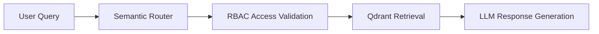
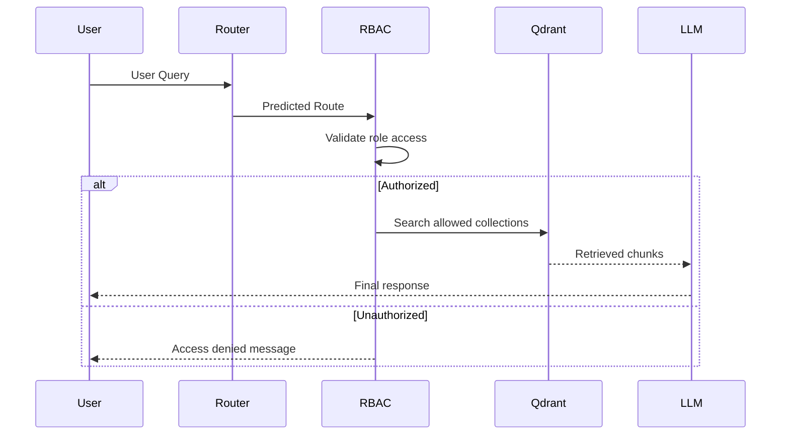

# Component 2: Query Routing with Semantic Router

## 📌 Objective

The FinBot system supports multiple departments such as Finance, Engineering, Marketing, HR, and Executive Management.
To improve retrieval accuracy and efficiency, a semantic query router is implemented before retrieval.

Instead of searching all vector collections for every query, the router intelligently determines:

* Which department/domain the query belongs to
* Which vector collections should be searched
* Whether the current user role has permission to access those collections

This reduces irrelevant retrievals and strengthens RBAC enforcement.

---

# 🏗️ Architecture Overview



---

# 🔍 Semantic Routing Design

The application uses the `semantic-router` library to classify user queries into predefined intent routes.

## Supported Routes

| Route                    | Purpose                                                   |
| ------------------------ | --------------------------------------------------------- |
| `finance_route`          | Revenue, budgets, financial reports, investor information |
| `engineering_route`      | APIs, architecture, incidents, onboarding, technical docs |
| `marketing_route`        | Campaigns, branding, competitors, market research         |
| `hr_general_route`       | Leave policy, benefits, employee handbook, HR             |
| `cross_department_route` | Broad queries spanning multiple departments               |

---

# 📁 Route Definitions

Each route contains at least 10 representative utterances.

## Example: Finance Route

```python
finance_utterances = [
    "Show me Q3 revenue",
    "What is the company budget allocation",
    "Investor report summary",
    "Quarterly earnings",
    "Operating margin details",
    "Financial forecast",
    "Annual report insights",
    "Revenue growth",
    "Expense breakdown",
    "Profit analysis"
]
```

---

# ⚙️ Semantic Router Implementation

## Router Setup

```python
from semantic_router import Route
from semantic_router.layer import RouteLayer
from semantic_router.encoders import HuggingFaceEncoder

encoder = HuggingFaceEncoder()

finance_route = Route(
    name="finance_route",
    utterances=finance_utterances
)

engineering_route = Route(
    name="engineering_route",
    utterances=engineering_utterances
)

marketing_route = Route(
    name="marketing_route",
    utterances=marketing_utterances
)

hr_general_route = Route(
    name="hr_general_route",
    utterances=hr_utterances
)

cross_department_route = Route(
    name="cross_department_route",
    utterances=cross_department_utterances
)

router = RouteLayer(
    encoder=encoder,
    routes=[
        finance_route,
        engineering_route,
        marketing_route,
        hr_general_route,
        cross_department_route
    ]
)
```

---

# 🔐 RBAC Enforcement after Routing

Routing alone is not enough.

Even if the router predicts a department correctly, the user's role must still be validated before retrieval.

## Example

A Finance user asking engineering questions:

```text
"Show me Kubernetes deployment architecture"
```

### Expected Behavior

* Query routes to `engineering_route`
* RBAC validation fails
* User receives:

```text
"You do not have access to Engineering documents."
```

No retrieval occurs from restricted collections.

---

# 🧠 Route to Collection Mapping

| Route                    | Collections Queried                   |
| ------------------------ | ------------------------------------- |
| `finance_route`          | `finance`, `general`                  |
| `engineering_route`      | `engineering`, `general`              |
| `marketing_route`        | `marketing`, `general`                |
| `hr_general_route`       | `general`                             |
| `cross_department_route` | All collections allowed for user role |

---

# 🔒 Role Access Matrix

| Role        | Accessible Collections |
| ----------- | ---------------------- |
| employee    | general                |
| finance     | finance + general      |
| engineering | engineering + general  |
| marketing   | marketing + general    |
| c_level     | all collections        |

---

# ⚡ Query Routing Flow



---

# 📦 Query Routing Service

## Example Service

```python
class QueryRouterService:

    def route_query(self, query: str):
        route = router(query)
        return route.name
```

---

# 🛡️ Security Considerations

The routing system itself does NOT enforce security.

RBAC enforcement happens:

* BEFORE retrieval
* AT vector database filtering layer
* BEFORE any LLM context generation

This prevents:

* Prompt injection leakage
* Unauthorized retrieval
* Cross-department document exposure

---

# 📊 Logging & Auditability

Every query stores:

| Field            | Description                  |
| ---------------- | ---------------------------- |
| username         | Logged in user               |
| role             | User role                    |
| query            | Original query               |
| predicted_route  | Router prediction            |
| collections_used | Final accessible collections |
| timestamp        | Query execution time         |

This supports enterprise audit requirements.

---

# 🚀 Benefits of Semantic Routing

## ✅ Improved Retrieval Precision

Only relevant collections are searched.

## ✅ Lower Retrieval Cost

Avoids unnecessary vector searches.

## ✅ Better Latency

Smaller search scope improves response time.

## ✅ Stronger Security

RBAC validation occurs before retrieval.

## ✅ Better Scalability

Easy to add new departments/routes later.

---

# 📈 Future Enhancements

Potential improvements:

* Hybrid semantic + keyword routing
* Confidence score thresholding
* Multi-route retrieval
* Dynamic route generation using LLMs
* User-specific personalization
* Learning routes from production traffic

---

# ✅ Component 2 Status

| Requirement                 | Status |
| --------------------------- | ------ |
| Semantic Router Implemented | ✅      |
| 5 Routes Configured         | ✅      |
| 10+ Utterances per Route    | ✅      |
| RBAC-aware Routing          | ✅      |
| Route Logging               | ✅      |
| Cross-department Routing    | ✅      |

---
